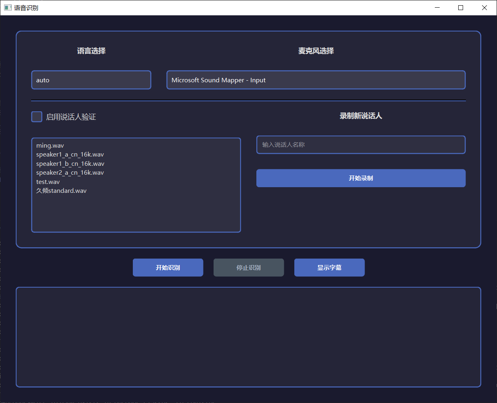
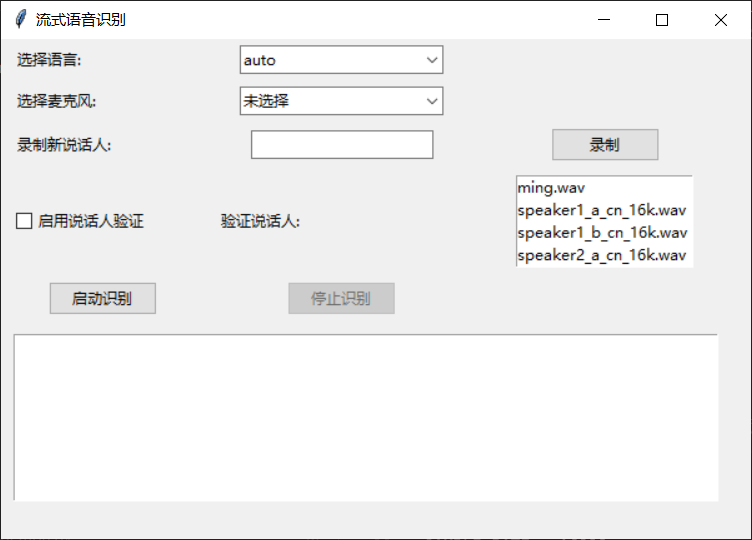

# api4sensevoice_pyui
在项目api4sensevoice基础上的python界面和命令行运行的语音识别  
在python=3.10.11环境下测试能使用，其余环境未测试
## 使用

- clisensevoice.py是基于api4sensevoice的server_wss.py服务运行的python终端STT
  将server_wss.py替换原来的server_wss.py或者改个名字，然后运行这个server_wss.py 
  创建一个新环境  
  将clisensevoice.py放置到该环境下  
  安装依赖  
  ```bash
  pip install pyaudio,websockets
  ```
  运行  
  ```bash
  python clisensevoice.py
  ```
  若要修改ip和端口号请自行查看，说话人的添加方式相同。  
  ``` python
  reg_spks_files = [
    "speaker/久倾standard.wav"
  ]
  ```  
- STT_qt.py是基于pyqt6的UI界面，STT_tk.py是基于tkinter的UI界面  
  将这两个文件放置到官方sensevoice文件夹下  
  安装依赖  
  ```bash
  pip install pyqt6,pyaudio,numpy,loguru,soundfile
  ```
  报错请检查看是否缺依赖或者包版本不对
  运行pyqt6页面  
  ```bash
  python STT_qt.py
  ```
  
  或者运行tk界面  
  ```bash
  python STT_tk.py
  ```
  

# 鸣谢
- 感谢[api4sensevoice](https://github.com/0x5446/api4sensevoice)项目
